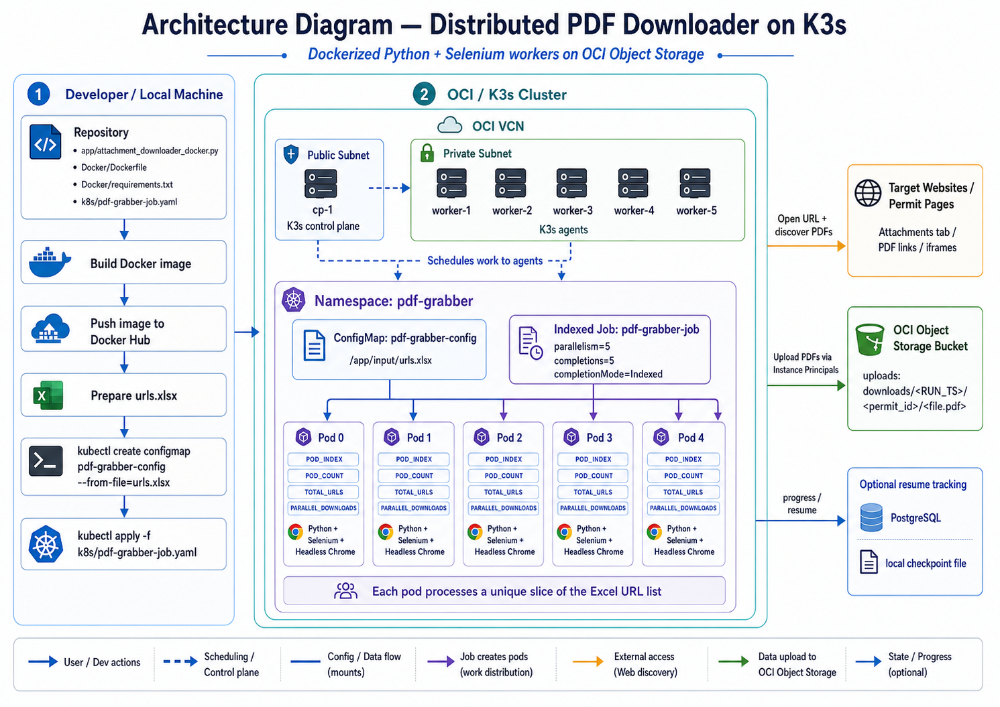

# Distributed PDF Downloader on Kubernetes

A Dockerized Python application that runs as a Kubernetes Indexed Job to download PDF attachments from URL records in an Excel file and upload the results to Oracle Cloud Infrastructure Object Storage.

The project is designed for distributed processing on a lightweight K3s cluster. Each pod receives a unique index, processes a separate slice of the URL list, downloads PDFs using Selenium with headless Chrome, and stores the final output in OCI Object Storage.

## Architecture



## Project Overview

This repository demonstrates a distributed PDF downloading workflow using Docker, Kubernetes/K3s, Selenium, and OCI Object Storage.

The main idea is simple:

1. Store source URLs in `urls.xlsx`.
2. Mount the Excel file into Kubernetes using a ConfigMap.
3. Run an Indexed Kubernetes Job with multiple pods.
4. Let each pod process a different slice of the URL list.
5. Download discovered PDF attachments.
6. Upload the downloaded PDFs to OCI Object Storage.

## How It Works

1. The Python downloader script is packaged into a Docker image.
2. The Docker image is pushed to Docker Hub.
3. The input Excel file is uploaded to the cluster as a Kubernetes ConfigMap.
4. A Kubernetes Indexed Job starts multiple worker pods.
5. Kubernetes assigns each pod a unique `POD_INDEX`.
6. The application reads `urls.xlsx` from `/app/input/urls.xlsx`.
7. The URL list is cleaned, deduplicated, and split across pods using `POD_INDEX` and `POD_COUNT`.
8. Each pod uses Selenium with headless Chrome to open target pages and discover PDF attachments.
9. PDFs are downloaded temporarily inside the container runtime.
10. Files are uploaded to OCI Object Storage using Instance Principals.
11. Progress can be tracked through optional PostgreSQL logging or local checkpoint files.

## Repository Structure

```text
.
├── app/
│   └── attachment_downloader_docker.py
├── Docker/
│   ├── Dockerfile
│   └── requirements.txt
├── k8s/
│   └── pdf-grabber-job.yaml
├── docs/
│   └── architecture.png
├── input/
│   └── .gitkeep
├── downloads/
│   └── .gitkeep
├── .gitignore
└── README.md
```

## What This Project Does

- Reads PDF source URLs from an Excel file.
- Uses Kubernetes Indexed Jobs to split work across multiple pods.
- Runs Selenium with headless Chrome inside the container.
- Opens target pages and searches for PDF attachments, links, iframes, and downloaded files.
- Uploads final PDFs to OCI Object Storage.
- Supports configurable runtime values through environment variables.
- Supports resume-style tracking through optional PostgreSQL logging or local checkpoints.

## Prerequisites

- Docker
- Docker Hub account
- Kubernetes or K3s cluster
- Oracle Cloud Infrastructure account
- OCI Object Storage bucket
- Excel file containing URLs
- OCI Instance Principal permissions for Object Storage access

## Build Docker Image

Run the build command from the repository root:

```bash
docker build -f Docker/Dockerfile -t pdf-grabber:v1 .
```

Tag the image for Docker Hub:

```bash
docker tag pdf-grabber:v1 your-dockerhub-username/pdf-grabber:v1
```

Push the image:

```bash
docker push your-dockerhub-username/pdf-grabber:v1
```

## Prepare Input File

Create an Excel file named:

```text
urls.xlsx
```

The first column should contain the URLs to process.

Do not commit real input files to GitHub. The `input/` folder is kept only as a placeholder.

Create the Kubernetes namespace:

```bash
kubectl create namespace pdf-grabber
```

Create the ConfigMap from the Excel file:

```bash
kubectl create configmap pdf-grabber-config \
  --from-file=urls.xlsx \
  -n pdf-grabber
```

## Configure Kubernetes Job

Before applying the job, update the image name in `k8s/pdf-grabber-job.yaml`:

```yaml
image: your-dockerhub-username/pdf-grabber:v1
```

Replace the OCI placeholder values:

```yaml
- name: OCI_NAMESPACE
  value: "replace-with-your-oci-namespace"
- name: OCI_BUCKET
  value: "replace-with-your-bucket-name"
```

Optional runtime values can also be adjusted in the job file:

```yaml
- name: POD_COUNT
  value: "5"
- name: TOTAL_URLS
  value: "50"
- name: PARALLEL_DOWNLOADS
  value: "1"
- name: OCI_PREFIX
  value: "downloads"
```

## Run the Kubernetes Job

Apply the manifest:

```bash
kubectl apply -f k8s/pdf-grabber-job.yaml
```

Check the pods:

```bash
kubectl get pods -n pdf-grabber
```

Follow logs:

```bash
kubectl logs -l job-name=pdf-grabber-job -n pdf-grabber -f
```

Check job status:

```bash
kubectl get jobs -n pdf-grabber
```

## Output Path

Downloaded files are uploaded to OCI Object Storage using this pattern:

```text
downloads/<RUN_TS>/<permit_id>/<file.pdf>
```

## Environment Variables

| Variable | Description |
|---|---|
| `EXCEL_PATH` | Path to the mounted Excel file. Default: `/app/input/urls.xlsx` |
| `OUT_DIR` | Temporary container download directory. Default: `/app/downloads` |
| `POD_INDEX` | Pod index assigned by the Kubernetes Indexed Job |
| `POD_COUNT` | Total number of worker pods |
| `TOTAL_URLS` | Maximum number of URLs to read from the Excel file |
| `PARALLEL_DOWNLOADS` | Number of parallel downloads per pod |
| `OCI_NAMESPACE` | OCI Object Storage namespace |
| `OCI_BUCKET` | OCI Object Storage bucket name |
| `OCI_PREFIX` | Prefix/path used when uploading files |
| `RUN_TS` | Timestamp folder used for uploaded output |
| `DB_ENABLE` | Enables optional PostgreSQL progress tracking when set to `true` |

## Git Ignore Policy

This repository intentionally excludes private setup notes, raw logs, Excel input files, downloaded PDFs, and local environment files.

Ignored local-only paths include:

```text
docs/setup/
docs/logs/
input/*.xlsx
downloads/*
.env
venv/
```

## Notes

This repository is meant to showcase the infrastructure and orchestration pattern. Real input files, logs, private setup notes, IP addresses, tokens, and cloud-specific secrets should stay outside the public repository.

## Future Improvements

- Add automated K3s setup scripts.
- Add Helm chart support.
- Add CI workflow for Docker image builds.
- Add sample input format.
- Add Kubernetes Secret support for non-instance-principal deployments.
